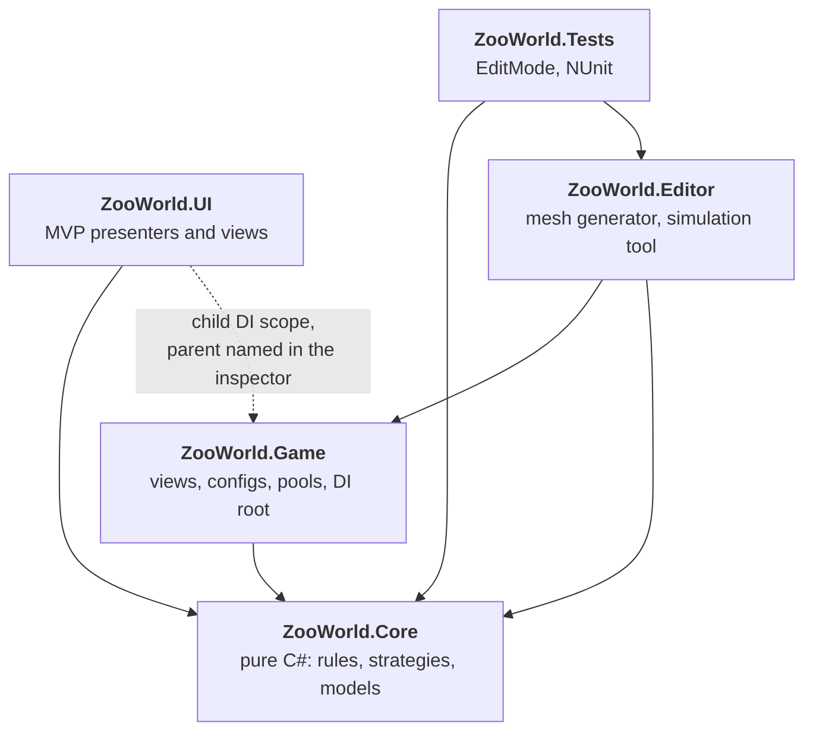
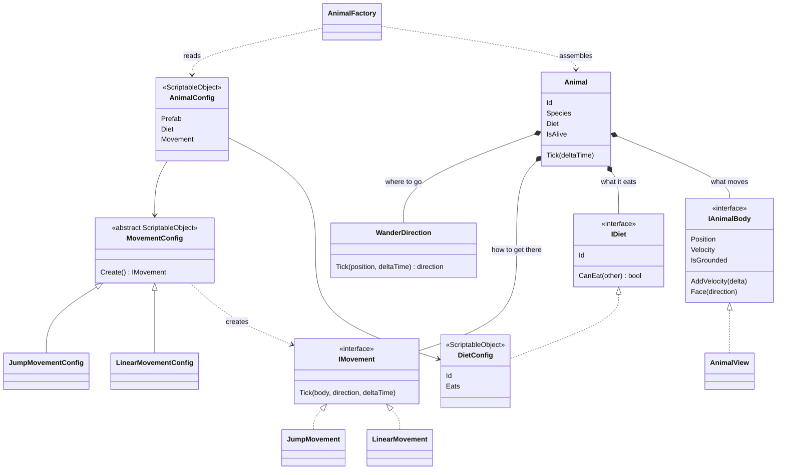
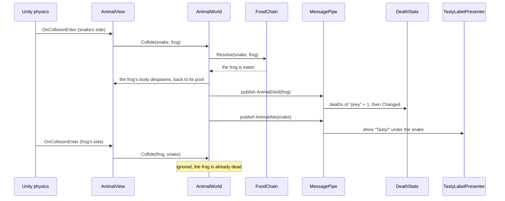
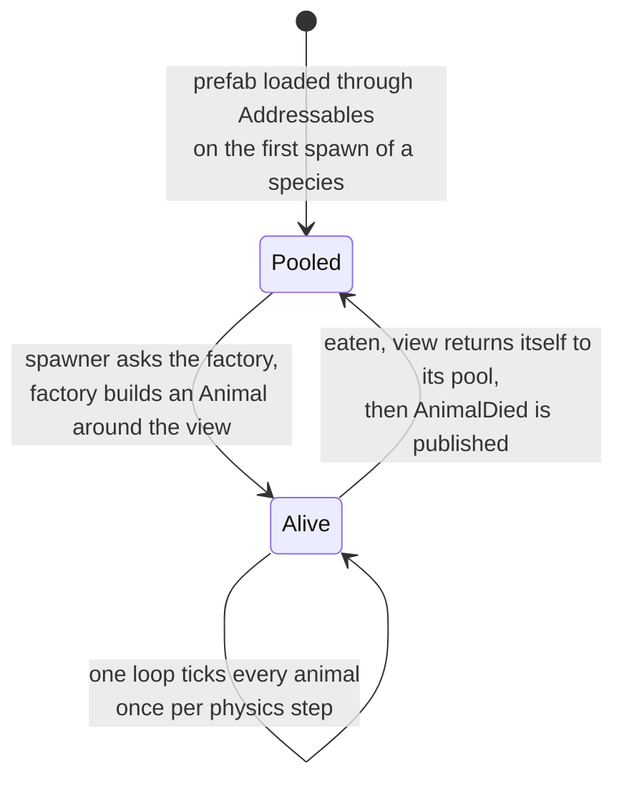
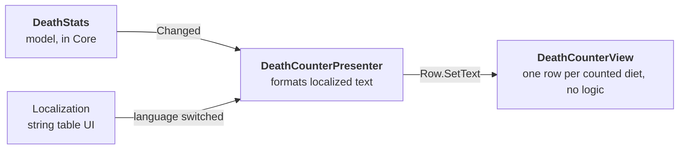
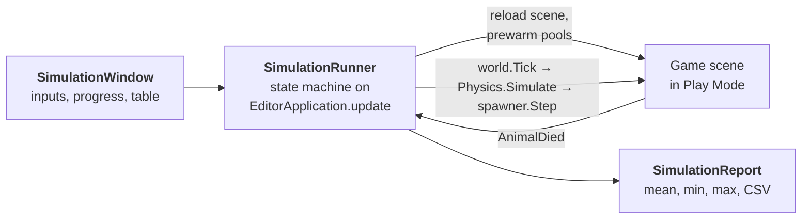

# Zoo World


A small Unity simulation. Every 1–2 seconds an animal appears on a top-down field, wanders, bumps into the others by physics, and eats or gets eaten according to a food chain.


## Contents

- [The brief, point by point](#the-brief-point-by-point)
- [Adding a new animal](#adding-a-new-animal)
- [Architecture](#architecture)
- [Shaders](#shaders)
- [Tech stack](#tech-stack)
- [Decisions and trade-offs](#decisions-and-trade-offs)
- [Performance notes](#performance-notes)
- [Simulation tool](#simulation-tool)
- [Tests](#tests)
- [Project layout](#project-layout)
- [Running it](#running-it)

## The brief, point by point

| The brief asks for | Where it lives |
|---|---|
| An animal appears every 1–2 seconds | `SpawnTimer` (rhythm), `AnimalSpawner` (what and where) |
| Animals move randomly | `WanderDirection` |
| Animals collide by physics | One `Rigidbody` + sphere collider per animal; movement nudges velocity and never overwrites it |
| An animal that leaves the screen comes back | `WanderDirection` asks `IPlayArea`; `CameraPlayArea` is the ground the camera sees |
| Prey bounce apart; predators eat | `DietConfig` assets say who eats whom; `FoodChain.Resolve` settles each meeting |
| Two predators: one survives | When each would eat the other, the one that has lived longer wins |
| "Tasty!" under the predator | `TastyLabelPresenter`, pooled label, DOTween |
| Frog jumps a fixed distance every X seconds | `JumpMovement` |
| Snake moves at constant speed | `LinearMovement` |
| Counters of dead prey and predators, uGUI | `DeathStats` (per diet) → `DeathCounterPresenter` → `DeathCounterView` |
| No ECS | Plain objects and MonoBehaviours |

## Adding a new animal

### A new species with existing behaviour: no code

1. **Create ▸ Zoo World ▸ Animal**. Pick a diet, a movement asset and a prefab.
2. Mark the asset Addressable and give it the label `animal`.

The game loads every asset with that label, so there is no enum of species, switch or registry to edit. A crab that walks like a snake and is eaten like a frog is two clicks.

### A new behaviour: one strategy

A bird that flies needs one class for the movement and one for its settings. Nothing existing changes.

```csharp
public sealed class GlideMovement : IMovement
{
    public void Tick(IAnimalBody body, Vector3 direction, float deltaTime) { /* ... */ }
}

[CreateAssetMenu(menuName = "Zoo World/Movement/Glide")]
public sealed class GlideMovementConfig : MovementConfig
{
    public override IMovement Create() => new GlideMovement();
}
```

### A new diet role

A diet is an asset too. **Create ▸ Zoo World ▸ Diet**, give it an id and list the diets it eats. A hawk that hunts only snakes, or a scavenger that eats nothing alive, needs no code: `FoodChain` asks each animal's diet about the other.

Deaths are counted per diet automatically. To show a new diet on screen, add a row to the `DeathCounter` object (diet id, string key, text) and a string to the `UI` table.

## Architecture

### Assemblies

Every dependency points toward `ZooWorld.Core`.



- **Core** has no MonoBehaviours. It is the part that is unit-tested.
- **Game** owns the gameplay views, configs and pools, so the composition root lives there.
- **UI** is referenced by nobody. Its scope names `GameLifetimeScope` as parent by type name, which VContainer resolves at runtime. Delete the `UI` folder and the game compiles and runs without an interface.

### An animal is data plus strategies

There is no `Frog` class and no `Snake` class.



Movement is split in two on purpose. *Where to go* (`WanderDirection`: a random heading, or "back to the centre" when off screen) is the same for every species. *How to get there* (`IMovement`) is what differs. A frog and a snake share the first and differ only in the second.

`MovementConfig` is the one inheritance in the project, a single level deep. It exists so the inspector can pick a movement type with an ordinary object field.

### What happens when a snake meets a frog



`AnimalWorld` finishes the death itself and only then announces it. It does not know who listens: the statistics and the UI subscribe on their own, and a listener that fails cannot leave the world half-updated.

### Life of a view



### MVP in the UI



Views are passive: they expose setters and events and decide nothing. The same shape is used for the language button and for the "Tasty!" label.


## Shaders

Everything on screen except the UI is drawn by one hand-written URP shader, `ZooWorld/Toon` (`Assets/Art/Shaders/Toon.shader`). It is plain HLSL, not Shader Graph, and uses no textures: the albedo is the vertex colour baked by the mesh generator, multiplied by `_BaseColor`.

| Material | Used by | Differs in |
|---|---|---|
| `Toon` | Animals, trees, rocks, bushes | Defaults |
| `ToonGround` | Ground | Outline width 0, rim strength 0 |
| `ToonSnake` | Snake | Wiggle amplitude 0.04, frequency 6 |

### Passes

| Pass | LightMode | What it does |
|---|---|---|
| `ForwardLit` | `UniversalForward` | Two-band lighting, rim light, fog |
| `Outline` | `SRPDefaultUnlit` | Inverted hull: front faces culled, back faces pushed outward |
| `ShadowCaster` | `ShadowCaster` | Main-light and punctual-light shadows, with URP's shadow bias |
| `DepthOnly` | `DepthOnly` | Depth prepass |
| `DepthNormals` | `DepthNormals` | World normals for the renderer's ambient occlusion feature |

All material properties sit in one `UnityPerMaterial` buffer declared in a shared `HLSLINCLUDE` block, which is what keeps every pass SRP Batcher compatible.

### Lighting

The lit pass reads only the main light and splits the surface into two bands:

```hlsl
half lit = smoothstep(_ShadeThreshold - _ShadeSoftness, _ShadeThreshold + _ShadeSoftness, dot(N, L));
lit *= smoothstep(0.5 - _ShadeSoftness, 0.5 + _ShadeSoftness, shadowAttenuation);
color = albedo * lightColor * lerp(_ShadeColor, 1, lit);
```

The shaded band is a tint, not a darkening, so shadows lean blue instead of grey. Received shadows go through the same threshold as the light direction, so a cast shadow has the same hard edge as the terminator.

The rim is `1 - dot(N, V)` cut by a 0.05-wide `smoothstep` at `_RimThreshold`, and it is multiplied by `lit`, so it shows on the lit side only.

### Outline

The outline pass moves each vertex along its normal by `_OutlineWidth` in world space, so the line has the same thickness whatever the object's scale.

The meshes are flat-shaded, which means every face has its own copy of each vertex with its own normal. Pushing those apart would tear the hull open at every edge. `LowPolyMeshBuilder` therefore bakes a second, smoothed set of normals into UV channel 3, and the outline pass uses that one. A mesh without it (length near zero) falls back to its ordinary normals.

### Snake wiggle

The snake has no bones and no animation clip. Its mesh is a straight tube, and the vertex stage bends it into a travelling sine:

```hlsl
void ApplyWiggle(inout float3 positionOS, inout float3 normalOS)
{
    float s, c;
    sincos((_WigglePhase + positionOS.z) * _WiggleFrequency, s, c);
    positionOS.x += _WiggleAmplitude * s;
    // Inverse transpose of the shear x += f(z).
    normalOS.z -= _WiggleAmplitude * _WiggleFrequency * c * normalOS.x;
    normalOS = normalize(normalOS);
}
```

- **One function, five passes.** It runs first in every vertex stage, so the outline, the shadow, the depth prepass and the ambient occlusion normals all bend with the body. The outline pass feeds it the smoothed normal.
- **Normals.** The displacement is a shear `x' = x + f(z)`, so normals are transformed by the inverse transpose of its Jacobian: only `n.z` changes, by `-f'(z) * n.x`. Without this the light band would stay where it was on the straight tube.
- **Phase is distance, not time.** `_WigglePhase` is the distance the snake has travelled nose-first, in world units. The wave therefore stays still relative to the ground while the body slides through it, the wiggle speed always matches the movement speed, and a snake that stops freezes.
- **Where the phase comes from.** `WigglePhase` (on the snake's mesh object) adds `dot(position - lastPosition, transform.forward)` every `LateUpdate` and writes the total through a `MaterialPropertyBlock`. It resets its reference position in `OnEnable`, so a pooled snake respawning elsewhere does not count the jump as travel.
- **Opt-in.** `_WiggleAmplitude` defaults to 0, so the other materials pay for one `sincos` and are otherwise untouched.

With the shipped values the wavelength is `2π / 6 ≈ 1.05` units against a body about 1.7 long, so roughly one and a half waves are visible at once.

Known limits:

| Limit | Why it is acceptable here |
|---|---|
| A property block takes the snake's renderer out of the SRP Batcher | A handful of snakes; every other object still batches |
| The cross-section is sheared, not rotated, so the body thins by `cos(atan(A·k))` on the steepest part | About 3% at amplitude 0.04 and frequency 6 |
| Mesh bounds are not enlarged for the displacement | 0.04 units sideways on a body 0.3 wide; no visible culling error |
| The collider does not bend | Animals collide as spheres anyway |
| The bend is only as smooth as the tube: 12 segments | Matches the low-poly look |

An earlier version computed the phase in the shader as the object's world position projected onto its forward axis. That needed no C# and kept the batcher, but the phase jumped whenever the snake turned, by an amount that grew with its distance from the world origin.

## Tech stack

| Tool | Role here | Why this one |
|---|---|---|
| **VContainer** | Dependency injection, entry points (`ITickable`, `IFixedTickable`, `IAsyncStartable`) | Fast, small, constructor injection for plain classes, parent/child scopes |
| **MessagePipe** | `AnimalDied` and `AnimalAte` between systems | Typed struct messages; integrates with VContainer; publisher and listeners stay strangers |
| **UniTask** | Awaiting Addressables loads | Lightweight async for Unity, with cancellation tied to scope lifetime |
| **Addressables** | Finding species by label, loading prefabs on first use | Content can grow to 1000 species without loading them all up front or keeping a list in code |
| **Localization** | Counter texts and "Tasty!" in English and Russian | Unity's own package; the UI reacts to a language switch without custom code |
| **DOTween** | "Tasty!" pop and fade | A one-line sequence instead of a hand-written animation |
| **uGUI + TextMeshPro** | HUD | Required by the brief |
| **Unity Test Framework** | 46 EditMode tests on the logic | The logic is plain C#, so the tests need no scene |
| **URP + custom HLSL shader** | Two-tone cel shading, rim light, outline, snake wiggle | A small hand-written shader; SRP Batcher compatible. See [Shaders](#shaders) |

## Decisions and trade-offs

| Decision | Why | What it costs |
|---|---|---|
| Species are assets; behaviour is composed from strategies | New animals need no code; behaviours can be mixed freely (a jumping predator is a config) | A truly new behaviour still means writing one class |
| Diet is a strategy asset, like movement | The brief names diet and movement as the two things that vary; both are now open to new values without touching code | Who eats whom is spread over the diet assets instead of sitting in one table |
| A dead animal's view is released by the world, not by a listener | Returning the view is part of dying, so it must not depend on an event being delivered | `IAnimalBody` carries one more method, `Despawn` |
| Movement changes velocity instead of setting it | Collisions stay physical: knocked animals fly back and recover | Speed is approximate for a moment after an impact |
| Sphere colliders for every animal, whatever the mesh | Cheapest shape for the physics engine; behaviour does not depend on art | Contact is not pixel-accurate on a long snake |
| One loop ticks all animals | One loop over plain objects is cheaper than the engine calling `FixedUpdate` on every animal | Animals cannot be paused individually by disabling a component |
| Views are pooled per species | No GameObject is instantiated or destroyed during play once the pool is warm | A view must be reset correctly when reused |
| MessagePipe only for cross-system events | Death and eating have several unrelated listeners | One more hop to follow when reading the code; direct one-to-one calls stay direct for that reason |
| UI in a child scope that nothing references | The game does not depend on its interface; the UI can be replaced or removed | The parent link is a type name in the scene, not a compile-time reference |
| The play area comes from the camera, once per frame | Follows a resized window or a moved camera without configuration | Assumes a camera looking down at flat ground |
| No pathfinding | The brief asks for random movement on an open field | Obstacles would need it; movement strategies are where it would plug in |
| No ECS | The brief forbids it | Nothing |
| Meshes are generated by Editor code | The repository contains the source of its art; anyone can rebuild or tweak it | Simple stylised shapes, not artist-made models |

## Performance notes

- **No per-animal update callbacks.** `AnimalSimulation` runs one loop per physics step.
- **Pooling** for animal views and for "Tasty!" labels.
- **Lazy loading.** A species' prefab is loaded the first time it spawns, then cached.
- **Ground check on demand.** A frog casts one ray when a jump is due, not every frame.
- **Layer collision matrix.** Animals test only against animals and the ground.
- **Two canvases.** Labels that move every frame do not make the static counters rebuild.
- **SRP Batcher.** One shader and three materials cover every object in the scene; colour comes from vertex data. Snakes are the exception: each carries a per-renderer wiggle phase, which takes it out of the batcher.
- **Optional population cap** in `GameSettings` (200 by default, 0 turns it off). It is a safety net well above what the field settles at; if it is ever reached, spawning pauses and a warning says so.

## Simulation tool

A balancing tool for game designers: it plays the world forward much faster than real time, several times over, and reports how many animals of each species were eaten. Change a config, press Run, read the numbers a few seconds later.

Open it with **Zoo World ▸ Simulation**.

### Using it

1. Open `Assets/Scenes/Game.unity`. The scene has to be saved: it is reloaded before every run.
2. Set **Duration**, in ticks or in seconds of game time. One tick is one physics step, `Fixed Timestep` = 0.02 s, so 3000 ticks is one minute of play.
3. Set **Runs**. Spawning and wandering are random, so one run is noisy; five to ten runs show whether a change moved the balance or only the dice.
4. Press **Run**. The window enters Play Mode by itself, shows progress, and leaves Play Mode when the series is done. **Cancel** stops it and keeps the runs already finished.

To compare two setups, edit the assets as usual (`GameSettings`, the movement and diet assets, the animal configs) and run again: every run starts from a freshly loaded scene and reads the configs anew.

### Reading the result

```
10 runs x 3190 ticks (63.8 s), play area 20.7 x 8.2

Species   Spawned   Eaten avg   min   max   Alive at end
Frog      21.4      18.4        15    22    3
Snake     20.4      16.2        12    22    4.2
```

| Column | Meaning |
|---|---|
| Spawned | Average per run; eaten plus still alive |
| Eaten avg, min, max | Per run. A difference between two setups smaller than the min–max spread is noise |
| Alive at end | Average population left when the run stops |

Rows are per species (the `AnimalConfig` asset name), not per diet, so two species that share a diet stay apart. **Copy CSV** puts the table on the clipboard for a spreadsheet.

The header shows the play area because it comes from the camera: a Game view with another aspect ratio is a field of another size, and its numbers are not comparable.

### How it works

Nothing is re-implemented: the tool drives the real scene, prefabs and colliders, so its numbers are the game's.



- **The clock is stopped, physics is stepped by hand.** For the length of a series `Time.timeScale` is 0 and `Physics.simulationMode` is `Script`, so the game's own loop does nothing, and the runner calls `AnimalWorld.Tick`, `Physics.Simulate` and `AnimalSpawner.Step` in the order of a game frame. Batches of about 50 ms keep the editor responsive.
- **A scene reload is the reset.** No class needs a `Reset` method, and no state leaks from one run into the next.
- **Pools are prewarmed** (`AnimalFactory.PrewarmAsync`), so the first spawn of a species does not wait for Addressables and land a few ticks late.
- **The HUD is switched off** while a series runs: it answers every meal with a tween, and tweens do not advance on a stopped clock.
- **Settings always go back.** Finishing, cancelling, an error, closing the window and stopping Play Mode by hand all restore the time scale, the physics mode and `Run In Background`.

On the development machine a run of 3000 ticks takes well under a second (about 22 000 ticks per second with the default settings). Checked against the game: 63.8 s of play at x1 ended with 21 prey and 15 predators eaten, inside the ranges in the table above.

The whole tool is three files in `Assets/Scripts/Editor/Simulation/` and is not part of a player build.

### Limits

| Limit | Why |
|---|---|
| Runs are not reproducible by seed | PhysX is not deterministic between runs; the series average is the answer to that |
| Needs Play Mode | Unity does not deliver collision callbacks in Edit Mode |
| The spawner ticks per physics step here and per frame in the game | The average spawn rate is the same; a single spawn may land a frame apart |
| Counts what is eaten per species, not who ate whom | Enough for the current two-species chain; `AnimalAte` already carries both sides if a matrix is needed |
| The window was exercised through its runner by script; the buttons themselves got less use | If something in the window misbehaves, the runner underneath is the tested part |

## Tests

46 EditMode tests cover the logic in `ZooWorld.Core` and the simulation tool's report. They need no scene and no physics: bodies, randomness, the play area and the message broker are small fakes.

| Fixture | What it pins down |
|---|---|
| `WanderDirectionTests` | Heading changes on schedule; an animal outside the area turns to the centre, including when the area shrinks under it |
| `LinearMovementTests` | Acceleration limit, settling speed, recovery after a knock-back |
| `JumpMovementTests` | Jump interval, grounded check, that the launch carries the frog the configured distance through the air, and that a shove just before does not change the hop |
| `FoodChainTests` | Prey and predator pairs in both argument orders, and a third diet that eats only predators |
| `AnimalWorldTests` | One death per collision even though Unity reports it twice; the dead neither eat nor die again; a failing listener does not corrupt the world |
| `DeathStatsTests` | Counting per diet, including one it was never told about; change notification; unsubscription |
| `AnimalTests` | An animal moves and faces along its wander direction |
| `SimulationReportTests` | Mean, min and max per species across runs; a species missing from a run counts as zero there; CSV keeps a decimal point under a comma locale |
| `SimulationRunnerTests` | Seconds convert to ticks, and a duration never drops below one tick |

Run them from **Window ▸ General ▸ Test Runner ▸ EditMode**, or headless with the Editor closed:

```
Unity.exe -batchmode -projectPath . -runTests -testPlatform EditMode -testResults Logs/results.xml
```

Physics and views are checked by running the scene.

## Project layout

```
Assets/
├── Scripts/
│   ├── Core/       pure C#: Animals, Events, Movement, World
│   ├── Game/       views, ScriptableObject configs, factory, pools, GameLifetimeScope
│   ├── UI/         presenters, views, UiLifetimeScope
│   ├── Editor/     LowPolyMeshBuilder, ZooMeshGenerator, prop placer window, Simulation/
│   └── Tests/      EditMode tests and fakes
├── Configs/        GameSettings, diet and movement assets, one AnimalConfig per species
├── Prefabs/        animals, UI label
├── Art/            generated meshes, materials, Toon shader
├── Physics/        the animals' physics material
├── Settings/       URP assets and renderers
├── Localization/
└── Scenes/Game.unity
```

## Running it

1. Open the project with **Unity 6000.6.3f1**. Packages restore on first open.
2. Open `Assets/Scenes/Game.unity` and press Play.

In the Editor, Addressables load straight from the asset database, so no content build is needed. Before a player build, build the Addressables content (**Window ▸ Asset Management ▸ Addressables ▸ Groups ▸ Build**) unless building it with the player is enabled.

The meshes can be rebuilt with **Zoo World ▸ Generate Meshes**.
