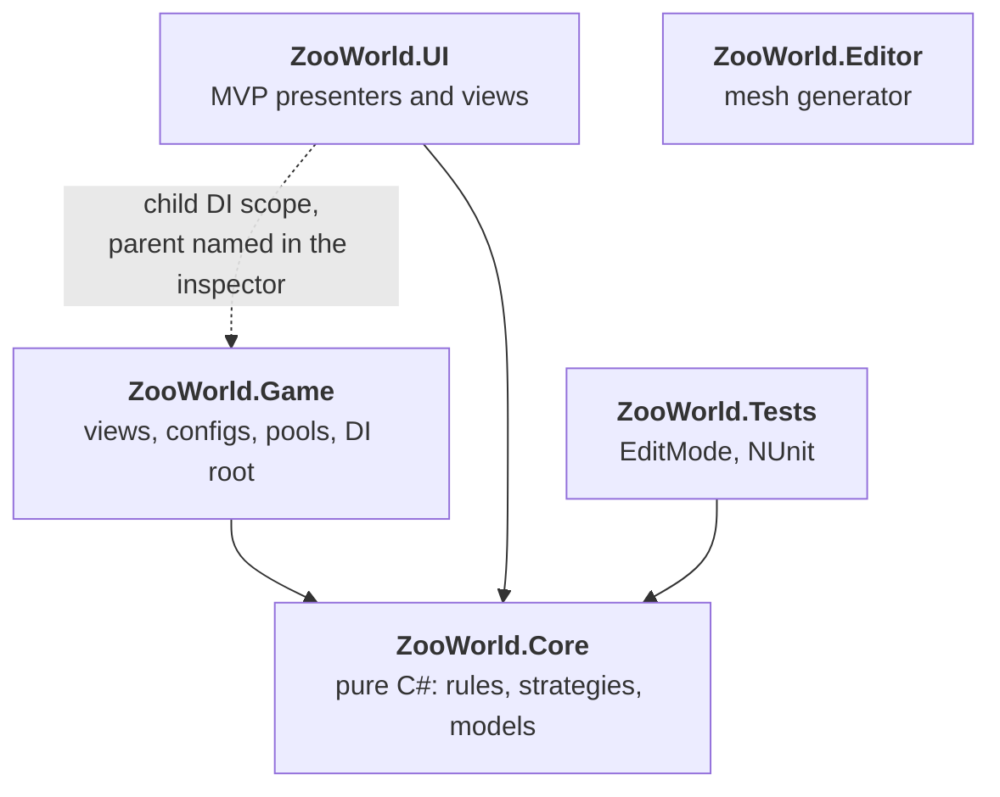
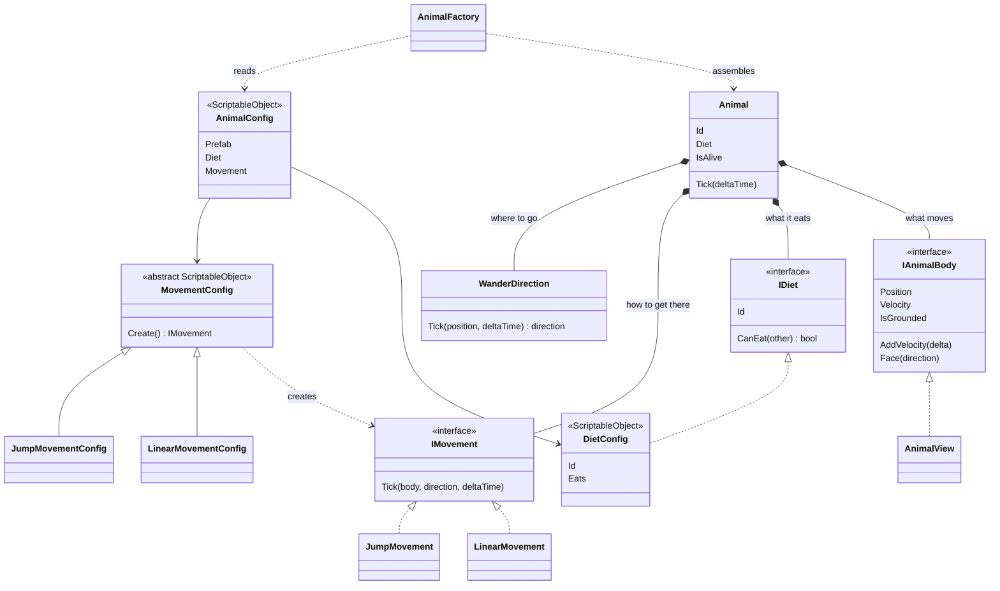
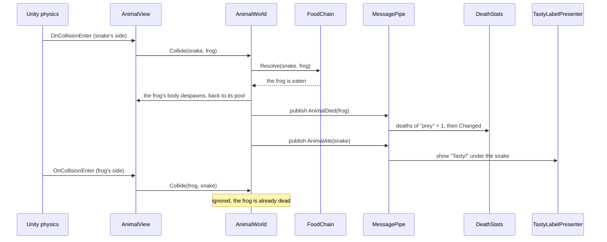
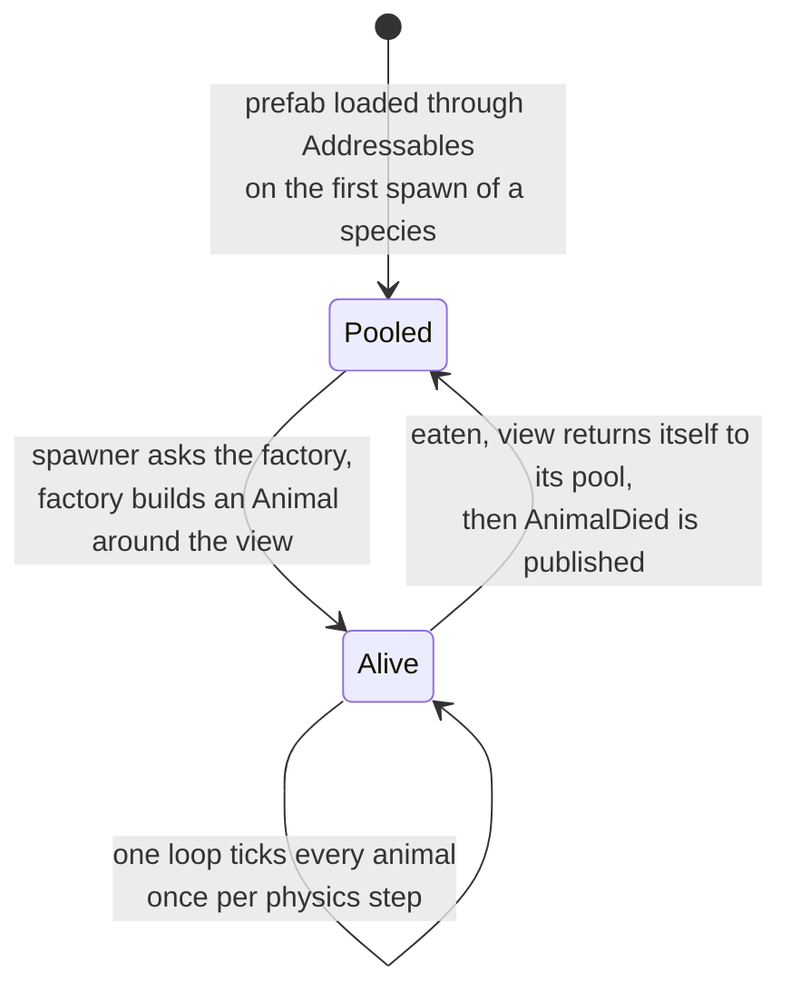
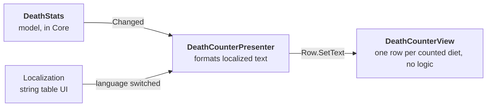

# Zoo World


A small Unity simulation. Every 1–2 seconds an animal appears on a top-down field, wanders, bumps into the others by physics, and eats or gets eaten according to a food chain.

The original brief is in [`Docs/Zoo world_2026_Tech_Specs.pdf`](Docs/Zoo%20world_2026_Tech_Specs.pdf).


## Contents

- [The brief, point by point](#the-brief-point-by-point)
- [Adding animal number 1001](#adding-animal-number-1001)
- [Architecture](#architecture)
- [Tech stack](#tech-stack)
- [Decisions and trade-offs](#decisions-and-trade-offs)
- [Performance notes](#performance-notes)
- [Tests](#tests)
- [Project layout](#project-layout)
- [Running it](#running-it)

## The brief, point by point

| The brief asks for | Where it lives |
|---|---|
| An animal appears every 1–2 seconds | `SpawnTimer` (rhythm), `AnimalSpawner` (what and where) |
| Animals move randomly | `WanderDirection` |
| Animals collide by physics | One `Rigidbody` + sphere collider per animal; movement nudges velocity and never overwrites it |
| An animal that leaves the screen comes back | `WanderDirection` asks `IPlayArea`; `CameraPlayArea` is the ground the camera sees |
| Prey bounce apart; predators eat | `DietConfig` assets say who eats whom; `FoodChain.Resolve` settles each meeting |
| Two predators: one survives | When each would eat the other, the one that has lived longer wins |
| "Tasty!" under the predator | `TastyLabelPresenter`, pooled label, DOTween |
| Frog jumps a fixed distance every X seconds | `JumpMovement` |
| Snake moves at constant speed | `LinearMovement` |
| Counters of dead prey and predators, uGUI | `DeathStats` (per diet) → `DeathCounterPresenter` → `DeathCounterView` |
| No ECS | Plain objects and MonoBehaviours |

## Adding new animal

### A new species with existing behaviour: no code

1. **Create ▸ Zoo World ▸ Animal**. Pick a diet, a movement asset and a prefab.
2. Mark the asset Addressable and give it the label `animal`.

That is all. There is no enum of species, no switch, no registry to edit: the game loads every asset with that label. A crab that walks like a snake and is eaten like a frog is two clicks.

### A new behaviour: one strategy

A bird that flies needs one class for the movement and one for its settings. Nothing existing changes.

```csharp
public sealed class GlideMovement : IMovement
{
    public void Tick(IAnimalBody body, Vector3 direction, float deltaTime) { /* ... */ }
}

[CreateAssetMenu(menuName = "Zoo World/Movement/Glide")]
public sealed class GlideMovementConfig : MovementConfig
{
    public override IMovement Create() => new GlideMovement();
}
```

### A new diet role

A diet is an asset too. **Create ▸ Zoo World ▸ Diet**, give it an id and list the diets it eats. A hawk that hunts only snakes, or a scavenger that eats nothing alive, needs no code: `FoodChain` asks each animal's diet about the other.

Deaths are counted per diet automatically. To show a new diet on screen, add a row to the `DeathCounter` object (diet id, string key, text) and a string to the `UI` table.

## Architecture

### Assemblies

Dependencies point one way: toward `ZooWorld.Core`.



- **Core** has no MonoBehaviours. It is the part that is unit-tested.
- **Game** owns the gameplay views, configs and pools, so the composition root lives there.
- **UI** is referenced by nobody. Its scope names `GameLifetimeScope` as parent by type name, which VContainer resolves at runtime. Delete the `UI` folder and the game compiles and runs without an interface.

### An animal is data plus strategies

There is no `Frog` class and no `Snake` class.



Movement is split in two on purpose. *Where to go* (`WanderDirection`: a random heading, or "back to the centre" when off screen) is the same for every species. *How to get there* (`IMovement`) is what differs. A frog and a snake share the first and differ only in the second.

`MovementConfig` is the one inheritance in the project, a single level deep. It exists so the inspector can pick a movement type with an ordinary object field.

### What happens when a snake meets a frog



`AnimalWorld` finishes the death itself and only then announces it. It does not know who listens: the statistics and the UI subscribe on their own, and a listener that fails cannot leave the world half-updated.

### Life of a view



### MVP in the UI



Views are passive: they expose setters and events and decide nothing. The same shape is used for the language button and for the "Tasty!" label.


## Tech stack

| Tool | Role here | Why this one |
|---|---|---|
| **VContainer** | Dependency injection, entry points (`ITickable`, `IFixedTickable`, `IAsyncStartable`) | Fast, small, constructor injection for plain classes, parent/child scopes |
| **MessagePipe** | `AnimalDied` and `AnimalAte` between systems | Typed struct messages; integrates with VContainer; publisher and listeners stay strangers |
| **UniTask** | Awaiting Addressables loads | Lightweight async for Unity, with cancellation tied to scope lifetime |
| **Addressables** | Finding species by label, loading prefabs on first use | Content can grow to 1000 species without loading them all up front or keeping a list in code |
| **Localization** | Counter texts and "Tasty!" in English and Russian | Unity's own package; the UI reacts to a language switch without custom code |
| **DOTween** | "Tasty!" pop and fade | A one-line sequence instead of a hand-written animation |
| **uGUI + TextMeshPro** | HUD | Required by the brief |
| **Unity Test Framework** | 35 EditMode tests on the logic | The logic is plain C#, so the tests need no scene |
| **URP + custom HLSL shader** | Two-tone cel shading, rim light, outline | A small hand-written shader; SRP Batcher compatible |

## Decisions and trade-offs

| Decision | Why | What it costs |
|---|---|---|
| Species are assets; behaviour is composed from strategies | New animals need no code; behaviours can be mixed freely (a jumping predator is a config) | A truly new behaviour still means writing one class |
| Diet is a strategy asset, like movement | The brief names diet and movement as the two things that vary; both are now open to new values without touching code | Who eats whom is spread over the diet assets instead of sitting in one table |
| A dead animal's view is released by the world, not by a listener | Returning the view is part of dying, so it must not depend on an event being delivered | `IAnimalBody` carries one more method, `Despawn` |
| Movement changes velocity instead of setting it | Collisions stay physical: knocked animals fly back and recover | Speed is approximate for a moment after an impact |
| Sphere colliders for every animal, whatever the mesh | Cheapest shape for the physics engine; behaviour does not depend on art | Contact is not pixel-accurate on a long snake |
| One loop ticks all animals | One loop over plain objects is cheaper than the engine calling `FixedUpdate` on every animal | Animals cannot be paused individually by disabling a component |
| Views are pooled per species | No GameObject is instantiated or destroyed during play once the pool is warm | A view must be reset correctly when reused |
| MessagePipe only for cross-system events | Death and eating have several unrelated listeners | One more hop to follow when reading the code; direct one-to-one calls stay direct for that reason |
| UI in a child scope that nothing references | The game does not depend on its interface; the UI can be replaced or removed | The parent link is a type name in the scene, not a compile-time reference |
| The play area comes from the camera, once per frame | Follows a resized window or a moved camera without configuration | Assumes a camera looking down at flat ground |
| No pathfinding | The brief asks for random movement on an open field | Obstacles would need it; movement strategies are where it would plug in |
| No ECS | The brief forbids it | — |
| Meshes are generated by Editor code | The repository contains the source of its art; anyone can rebuild or tweak it | Simple stylised shapes, not artist-made models |

## Performance notes

- **No per-animal update callbacks.** `AnimalSimulation` runs one loop per physics step.
- **Pooling** for animal views and for "Tasty!" labels.
- **Lazy loading.** A species' prefab is loaded the first time it spawns, then cached.
- **Ground check on demand.** A frog casts one ray when a jump is due, not every frame.
- **Layer collision matrix.** Animals test only against animals and the ground.
- **Two canvases.** Labels that move every frame do not make the static counters rebuild.
- **SRP Batcher.** One shader and two materials cover every object in the scene; colour comes from vertex data.
- **Optional population cap** in `GameSettings` (200 by default, 0 turns it off). It is a safety net well above what the field settles at; if it is ever reached, spawning pauses and a warning says so.

## Tests

35 EditMode tests cover the logic in `ZooWorld.Core`. They need no scene and no physics: bodies, randomness, the play area and the message broker are small fakes.

| Fixture | What it pins down |
|---|---|
| `WanderDirectionTests` | Heading changes on schedule; an animal outside the area turns to the centre, including when the area shrinks under it |
| `LinearMovementTests` | Acceleration limit, settling speed, recovery after a knock-back |
| `JumpMovementTests` | Jump interval, grounded check, that the launch carries the frog the configured distance through the air, and that a shove just before does not change the hop |
| `FoodChainTests` | Prey and predator pairs in both argument orders, and a third diet that eats only predators |
| `AnimalWorldTests` | One death per collision even though Unity reports it twice; the dead neither eat nor die again; a failing listener does not corrupt the world |
| `DeathStatsTests` | Counting per diet, including one it was never told about; change notification; unsubscription |
| `AnimalTests` | An animal moves and faces along its wander direction |

Run them from **Window ▸ General ▸ Test Runner ▸ EditMode**, or headless with the Editor closed:

```
Unity.exe -batchmode -projectPath . -runTests -testPlatform EditMode -testResults Logs/results.xml
```

Physics and views are checked by running the scene.

## Project layout

```
Assets/ZooWorld/
├── Core/       pure C# — Animals, Movement, Spawning, Stats, World
├── Game/       views, ScriptableObject configs, factory, pools, GameLifetimeScope
├── UI/         presenters, views, UiLifetimeScope
├── Editor/     LowPolyMeshBuilder, ZooMeshGenerator
├── Tests/      EditMode tests and fakes
├── Configs/    GameSettings, diet and movement assets, one AnimalConfig per species
├── Prefabs/    animals, UI label
├── Art/        generated meshes, materials, Toon shader
├── Localization/
└── Scenes/Game.unity
```

## Running it

1. Open the project with **Unity 6000.6.3f1**. Packages restore on first open.
2. Open `Assets/ZooWorld/Scenes/Game.unity` and press Play.

In the Editor, Addressables load straight from the asset database, so no content build is needed. Before a player build, build the Addressables content (**Window ▸ Asset Management ▸ Addressables ▸ Groups ▸ Build**) unless building it with the player is enabled.

The meshes can be rebuilt with **Zoo World ▸ Generate Meshes**.
